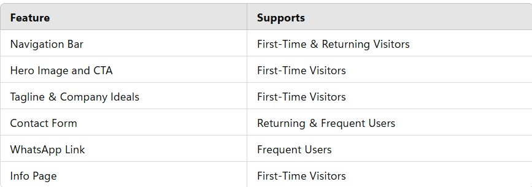
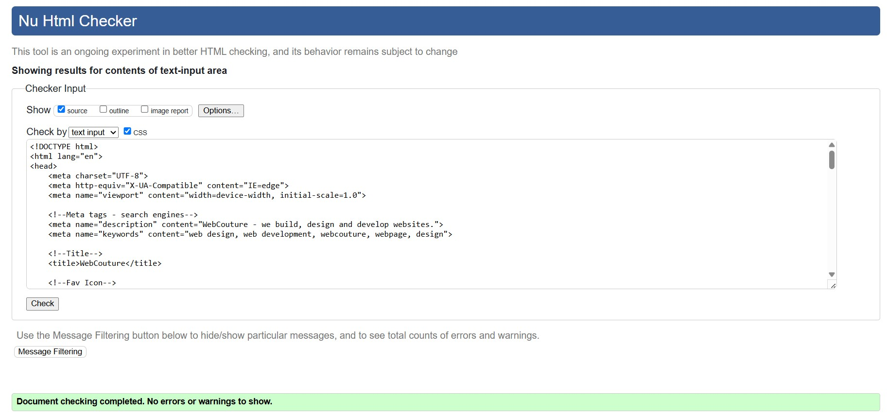
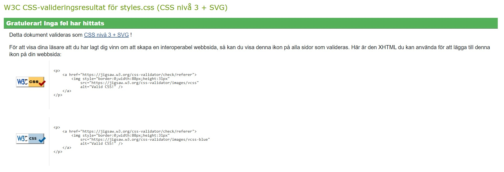
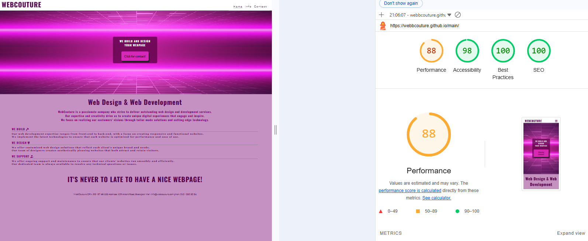

## WebCouture Website

View the live project here: https://webbcouture.github.io/main/

## Overview
Welcome to WebCouture — a clean, responsive website designed to showcase professional web development services for a company targeting female clients. The client requested a pink and purple color scheme to create a visually appealing, feminine aesthetic. The site is built using HTML, CSS, and a touch of JavaScript, and is fully responsive for desktop and mobile devices, including smaller screens like the iPhone 5.

## Table of Contents
- **User Experience**
- **Features**
- **How Features Support User Stories**
- **Design**
- **Wireframes**
- **Technologies Used**
- **Testing**
- **Deployment**
- **Credits**
- **Acknowledgments**

## User Experience
### First-Time Visitor Goals
- Understand the main purpose of the site quickly.
- Navigate the site easily to find information.
- Locate the menu and contact pages effortlessly.
- Learn what the company offers and how to get in touch.

## Returning Visitor Goals
- Quickly access the contact form.
- Find social media links.
- Get in touch to give feedback or ask questions.

## Frequent User Goals:
- As a Frequent User, I want to easy fit the company´s contact on whatsup to call or text them.

## Features
🧭 Navigation Bar
- Appears on all three pages.
- Responsive across screen sizes.
- Displays logo and links to Home, Menu, and Contact.
- On mobile, navigation links shift below the logo for better visibility.

🌸 Landing Page Image and Call to Action
- Pink-themed hero image with the message: "We fix your page! It's never too late to have a nice webpage"
- Aimed to immediately attract female users.

💬 Tagline
"We design and build your webpage" text reinforces the company’s services.

Company Ideals section
The two main things the company do are presented in two sections on the main page. This give the user more information about the organization and the two things (We Build, We Design) they offer

📝 Info Page
- The Info Page is a page that tells the customer about the company, what we do and about our experience.

📬 Contact Page
- Allows users to send feedback or inquiries.
- Form includes name and email fields.
- Confirmation message: “Your message has been sent.”

🔗 Footer
- Present on all pages, identical for consistency.
- Includes social media icons: Facebook, WhatsApp, and Instagram.
- WhatsApp is emphasized for international communication.

## How these features support the User Stories

## Features which could be implemented in the future
- On the info page we can add som reference and pictures and links on webpages that we have done and some quotes from happy costomers.
- We can add a map and an adress when the company have moved in to their office.

## Design
- The pink picture, and the pink/purple style, has been chosen to attract female customers.
- The info picture has ben chosen to show that the company design the webpage to look good on all screen sizes.

🎨 Color Scheme
- We choose our palette from the pink picture that tha costumer want to have and mix it well so its easy to reed with the background colors and text colors.

🔠 Typography
- Google Fonts used:
- Lato for body text
- Georgia for stylistic headings
- Oswald for standout titles

## Wireframes
**Created with Balsamiq during the planning stage:**

- Main Page Wireframe

  

- Info Page Wireframe

  

- Contact Page Wireframe

  

## Technologies Used
Languages Used:
- HTML5
- CSS3
- JavaScript

## Frameworks, Libraries & Programs Used
### Google Fonts: 
- was used to import the 'Lato' 'Georgia' and 'Oswald' fonts into the style.css file which are used on all pages of the project.
### Font Awesome: 
- was used to add icons for aesthetic and UX purposes.
### Git: 
- was used for version control by utilizing the Gitpod terminal to commit to Git and Push to GitHub.
### GitHub: 
- is used as the repository for the projects code after being pushed from Git.
### Microsoft Paint 3D: 
- was used for resizing images and editing photos for the website.
### Balsamiq: 
- was used to create the wireframes during the design process.

## Testing
### HTML Validator Results
- menu.html ✅ Valid

- info.html ✅ Valid

- contact.html ✅ Valid

## CSS Validator

## Lighthouse scores
- **Performance:** 86
- **Accessibility:** 100
- **Best Practices:** 100
- **SEO:** 100

## Browser Compatibility
### Tested on:
- Chrome Version 90.0.4430.212 (Official Build) (64-bit)
- Firefox Version 88.0.1 (64-bit)
- Edge Version 90.0.818.62 (Official build) (64-bit)
- Safari on macOS Catalina (Safari Version 14.0.3)
- Test Cases and Results

## Test Cases and Results

## Known bugs
- No known bugs at this time.

## Deployment
- How this site was deployed In the GitHub repository, navigate to the Settings tab, then choose Pages from the left hand menu
- From the source section drop-down menu, select the Master Branch
- Once the master branch has been selected, the page will be automatically refreshed with a detailed ribbon display to indicate the successful deployment
- Any changes pushed to the master branch will take effect on the live project
- The live link can be found here https://webbcouture.github.io/main/

## How to clone the repository
- Go to the https://webbcouture.github.io/main/ repository on GitHub
- Click the "Code" button to the right of the screen.
- Click HTTPs and copy the link there
- Open a GitBash terminal and navigate to the directory where you want to locate the clone
- On the command line, type "git clone" then paste in the copied url and press the Enter key to begin the clone process.

## Credits
- Content on the menu page was loosely based on menus on Love Running 
- All other content was written by the developer.

## Code
- Fade-in hero image adapted from a CSS tutorial.

## Media
- Colors based on client’s pink image.
- Icons: Font Awesome
- Fonts: Google Fonts
- Images: Unsplash

## Acknowledgments
- Special thanks to mentor Brian Macharia for guidance and constructive feedback during the project.

Amanda​